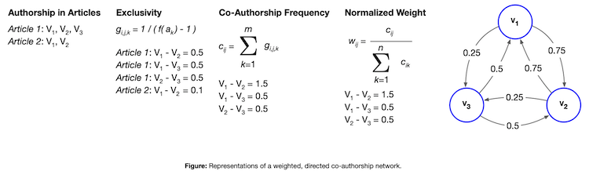

# AuthorRank
A modification of PageRank to find the most prestigious authors in a scientific collaboration network.

[](#)
[](https://pypi.python.org/pypi/author_rank/0.1.3)
[](https://opensource.org/licenses/MIT)
[](https://coveralls.io/github/adidier17/AuthorRank?branch=main)
[](https://travis-ci.org/adidier17/AuthorRank)

## Purpose
A key question in the analysis of collaborative networks is: 
"Who are the most prestigious authors?" Answering this question can be 
useful in identifying subject matter experts or in ranking search 
results. This library implements [AuthorRank](http://dx.doi.org/10.1016/j.ipm.2005.03.01) - an approach by 
Liu et. al. to determine the most prestigious authors across a 
research network utilizing a body of research papers. 

## Dependencies 
- Python 3.5 - 3.8 
- networkx >= 2.4
- python-utils >= 2.4.0
- scipy >= 1.4.1

## How To

First install the package locally:

```shell
pip install author-rank # or pip3 install ... if you're using both Python 3 and 2.
```

Then, assuming you have input data in a format like the following: 

```
documents = [
    {
      "title": "Always lurking: understanding and mitigating bias in online human trafficking detection",
      "authors": [
        {
          "first_name": "Kyle",
          "last_name": "Hundman",
          "affiliation": {
            "name": "NASA Jet Propulsion Laboratory",
            "department": "Office of the Chief Information Officer"
          }
        },
        {
          "first_name": "Thamme",
          "last_name": "Gowda",
          "affiliation": {
            "name": "University of Southern California"
          }
        },
        {
          "first_name": "Mayank",
          "last_name": "Kejriwal",
          "affiliation": {
            "name": "University of Southern California"
          }
        },
        {
          "first_name": "Benedikt",
          "last_name": "Boecking",
          "affiliation": {
            "name": "Carnegie Mellon University"
          }
        }
      ]
    },
    {
      "title": "Measurement Context Extraction from Text: Discovering Opportunities and Gaps in Earth Science",
      "authors": [
        {
          "first_name": "Kyle",
          "last_name": "Hundman",
          "affiliation": {
            "name": "NASA Jet Propulsion Laboratory",
            "department": "Office of the Chief Information Officer"
          }
        },
        {
          "first_name": "Chris",
          "last_name": "Mattmann",
          "affiliation": {
            "name": "University of Southern California",
            "department": "Computer Science Department"
          }
        }
      ]
    },
    {
      "title": "An approach for automatic and large scale image forensics",
      "authors": [
        {
          "first_name": "Thamme",
          "last_name": "Gowda",
          "affiliation": {
            "name": "University of Southern California"
          }
        },
        {
          "first_name": "Kyle",
          "last_name": "Hundman",
          "affiliation": {
            "name": "NASA Jet Propulsion Laboratory",
            "department": "Office of the Chief Information Officer"
          }
        },
        {
          "first_name": "Chris",
          "last_name": "Mattmann",
          "affiliation": {
            "name": "University of Southern California",
            "department": "Computer Science Department"
          }
        }
      ]
    }
]
```

One can compute retrieve a ranked list of authors and their scores 
according to the AuthorRank algorithm: 

```python
# import AuthorRank
import author_rank as ar

# create an AuthorRank object
ar_graph = ar.Graph()

# fit to the data
ar_graph.fit(
    documents=documents
)

# get the top authors for a set of documents
ar_graph.top_authors(normalize_scores=True, n=10)
```

Setting _normalized_scores_ to `True` normalizes the AuthorRank scores 
on a scale of 0 to 1 (inclusive), which may be helpful for interpretation.  

### Specifying Authorship Keys 

By default, AuthorRank looks for a list of authors - with each author 
represented as a dictionary of keys and values - from each document 
in the list of documents passed into `fit` using 
the key `authors`, with the keys `first_name` and `last_name` as the 
keys used to uniquely identify each author. However, if desired other keys 
could be specified and utilized, as in the example below: 

```python
ar_graph.fit(
    documents=documents,
    authorship_key="creators", 
    keys=set(["given", "family"])
)
ar_graph.top_authors(normalize_scores=True, n=10)
```

### Exporting the Co-Authorship Graph

It is also possible to export the directed graph from the provided input data, 
with weights, into a JSON format for use in visualization or additional 
analysis:

```python
export = ar_graph.as_json()
print(json.dumps(export, indent=4))
```

### Progress Bar 
When creating the AuthorRank graph, the `progress_bar` 
parameter can be used to indicate the progress of applying AuthorRank to 
a set of documents. This can be helpful when processing larger corpora 
of documents as it provides a rough indication of the remaining time 
needed to complete execution. 

```python
# fit to the data
ar_graph.fit(
    documents=documents,
    progress_bar=True
)
```

### Running the CORD-19 Examples

Make sure to download the [CORD-19](https://www.semanticscholar.org/cord19) 
dataset and adjust the file paths 
in the examples appropriately for your dataset version (indicated by a 
date). The dataset is too large to be included in the repository and thus 
needs to be downloaded separately. 

To get started with the examples in the repository (using the same 
version of the CORD-19 dataset), run the following: 

```
cd data
mkdir CORD-19
cd CORD-19
wget https://ai2-semanticscholar-cord-19.s3-us-west-2.amazonaws.com/historical_releases/cord-19_2020-07-16.tar.gz
tar -xf cord-19_2020-07-16.tar.gz
rm cord-19_2020-07-16.tar.gz
cd ../..
```

## About
This library (of the same name) implements AuthorRank [1]. AuthorRank 
is a modification of PageRank, Google's original algorithm for ranking 
webpage search results. PageRank works on the idea of transferred 
status. The rank of a page is the sum of the ranks of
its backlinks - if a webpage has many backlinks or a few highly ranked 
backlinks, its rank is also high. The algorithm works over a directed 
graph in which nodes are webpages and a directed edge represents a link 
from one page to another. It is assumed that each node transfers its 
rank evenly to all of the other nodes it connects to. Instead of webpages, AuthorRank creates a
co-authorship network that represents the structure of scientific collaborations and the status
of individual researchers. In the network, each node represents an author and each edge
represents a collaboration. Edges are bi-directional to represent the symmetric nature of
collaboration. Unlike PageRank in which each node is assumed to transfer status equally, when
considering status in a collaboration, greater status should be given to authors who frequently
coauthor together, and status should be diminished as the number of authors in a paper
increases. Thus, edges are weighted according to frequency of co-authorship and total number
of co-authors on articles according to the diagram shown below.




The applicability of this approach is not confined to research 
collaborations and this module could be extended into other useful 
applications utilizing similar directed graphs (for example, it may be 
interesting to examine the [Enron email corpus](https://www.cs.cmu.edu/~enron/)).

## Contributing

Please use the issue tracker to report any erroneous behavior or desired 
feature requests. 

If you would like to contribute to development, please fork the repository and make 
any changes to a branch which corresponds to an open issue. Hot fixes 
and bug fixes can be represented by branches with the prefix `fix/` versus 
`feature/` for new capabilities or code improvements. Pull requests will 
then be made from these branches into the repository's `dev` branch 
prior to being pulled into `main`. Pull requests which are works in 
progress or ready for merging should be indicated by their respective 
prefixes (`[WIP]` and `[MRG]`). Pull requests with the `[MRG]` label will be 
reviewed prior to being pulled into the `main` branch. 

### Running Tests

Tests are contained within the `tests` directory. To run tests for 
AuthorRank, call pytest and pytest-cov via the command line:

```bash
python3 -m pytest --cov=author_rank -vv
```

The tests included within the repository are automatically run on commit 
to repository branches and any external pull requests 
[using Travis CI](https://api.travis-ci.org/adidier17/AuthorRank.svg?branch=master). 

## Versioning
[Semantic versioning](http://semver.org/) is used for this project. If contributing, please conform to semantic
versioning guidelines when submitting a pull request.

## License
This project is licensed under the MIT license.

## References 

1. Xiaoming Liu, Johan Bollen, Michael L. Nelson, Herbert Van de Sompel, 
Co-authorship networks in the digital library research community, 
Information Processing & Management, Volume 41, Issue 6, 2005, 
Pages 1462-1480, ISSN 0306-4573, http://dx.doi.org/10.1016/j.ipm.2005.03.012. 
[Pre-print PDF](https://arxiv.org/pdf/cs/0502056.pdf).

