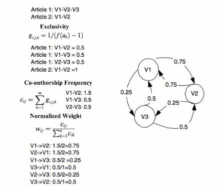

# AuthorRank
A modification of PageRank to find the most prestigious authors in a scientific collaboration network.

[](#)
[](https://pypi.python.org/pypi/author_rank/0.0.1)
[](https://opensource.org/licenses/MIT)
[](https://coveralls.io/github/adidier17/AuthorRank?branch=master)
[](https://travis-ci.org/adidier17/AuthorRank)

## Purpose
A key question in the analysis of collaborative networks is: 
"Who are the most prestigious authors?" Answering this question can be 
useful in identifying subject matter experts or in ranking search 
results. This library implements an approach to determining 
the most prestigious authors across a research network utilizing a body 
of research papers. 

## Dependencies 
- Python 3.5 - 3.8 
- networkx >= 2.4
- numpy >= 1.18.1
- scikit-learn >= 0.22.1

## How To

First install the package locally:

```shell
pip install . # or pip3 install ... if you're using both Python 3 and 2.
```

Then, assuming you have input data in a format like the following: 

```
documents = [
    {
      "title": "Always lurking: understanding and mitigating bias in online human trafficking detection",
      "authors": [
        {
          "first_name": "Kyle",
          "last_name": "Hundman",
          "affiliation": {
            "name": "NASA Jet Propulsion Laboratory",
            "department": "Office of the Chief Information Officer"
          }
        },
        {
          "first_name": "Thamme",
          "last_name": "Gowda",
          "affiliation": {
            "name": "University of Southern California"
          }
        },
        {
          "first_name": "Mayank",
          "last_name": "Kejriwal",
          "affiliation": {
            "name": "University of Southern California"
          }
        },
        {
          "first_name": "Benedikt",
          "last_name": "Boecking",
          "affiliation": {
            "name": "Carnegie Mellon University"
          }
        }
      ]
    },
    {
      "title": "Measurement Context Extraction from Text: Discovering Opportunities and Gaps in Earth Science",
      "authors": [
        {
          "first_name": "Kyle",
          "last_name": "Hundman",
          "affiliation": {
            "name": "NASA Jet Propulsion Laboratory",
            "department": "Office of the Chief Information Officer"
          }
        },
        {
          "first_name": "Chris",
          "last_name": "Mattmann",
          "affiliation": {
            "name": "University of Southern California",
            "department": "Computer Science Department"
          }
        }
      ]
    },
    {
      "title": "An approach for automatic and large scale image forensics",
      "authors": [
        {
          "first_name": "Thamme",
          "last_name": "Gowda",
          "affiliation": {
            "name": "University of Southern California"
          }
        },
        {
          "first_name": "Kyle",
          "last_name": "Hundman",
          "affiliation": {
            "name": "NASA Jet Propulsion Laboratory",
            "department": "Office of the Chief Information Officer"
          }
        },
        {
          "first_name": "Chris",
          "last_name": "Mattmann",
          "affiliation": {
            "name": "University of Southern California",
            "department": "Computer Science Department"
          }
        }
      ]
    }
]
```

One can compute retrieve a ranked list of authors and their scores 
according to the AuthorRank algortithm: 

```python
from author_rank.score import top_authors

top_authors(documents, normalize_scores=True, n=10)
```

Setting _normalized_scores_ to `True` normalizes the AuthorRank scores 
on a scale of 0 to 1 (inclusive), which may be helpful for interpretation.  

It is also possible to export the directed graph from the provided input data, 
with weights, into a JSON format for use in visualization or additional 
analysis:

```python
from author_rank.graph import create, export_to_json

G = create(documents=documents)
export_to_json(G)
```

## About
This library (of the same name) implements AuthorRank [1]. AuthorRank 
is a modification of PageRank, Google's original algorithm for ranking 
webpage search results. PageRank works on the idea of transferred 
status. The rank of a page is the sum of the ranks of
its backlinks - if a webpage has many backlinks or a few highly ranked 
backlinks, its rank is also high. The algorithm works over a directed 
graph in which nodes are webpages and a directed edge represents a link 
from one page to another. It is assumed that each node transfers its 
rank evenly to all of the other nodes it connects to. Instead of webpages, AuthorRank creates a
co-authorship network that represents the structure of scientific collaborations and the status
of individual researchers. In the network, each node represents an author and each edge
represents a collaboration. Edges are bi-directional to represent the symmetric nature of
collaboration. Unlike PageRank in which each node is assumed to transfer status equally, when
considering status in a collaboration, greater status should be given to authors who frequently
coauthor together, and status should be diminished as the number of authors in a paper
increases. Thus, edges are weighted according to frequency of co-authorship and total number
of co-authors on articles according to the diagram shown below.


The applicability of this approach is not confined to research 
collaborations and this module could be extended into other useful 
applications utilizing similar directed graphs. 

## Contributing
If you would like to contribute, please fork the repository and make 
any changes locally prior to submitting a pull request. 
Feel free to open an issue if you notice any erroneous behavior.

## Versioning
[Semantic versioning](http://semver.org/) is used for this project. If contributing, please conform to semantic
versioning guidelines when submitting a pull request.

## License
This project is licensed under the MIT license.

## Tests

Tests are contained within the `tests` directory. To run tests for 
AuthorRank, call pytest and pytest-cov via the command line:

```bash
python3 -m pytest --cov=author_rank -vv
```

Setting up a virtual environment for testing and development is recommended. 

## References 

1. Xiaoming Liu, Johan Bollen, Michael L. Nelson, Herbert Van de Sompel, 
Co-authorship networks in the digital library research community, 
Information Processing & Management, Volume 41, Issue 6, 2005, 
Pages 1462-1480, ISSN 0306-4573, http://dx.doi.org/10.1016/j.ipm.2005.03.012.

