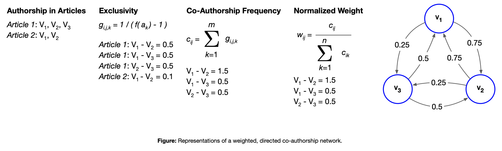
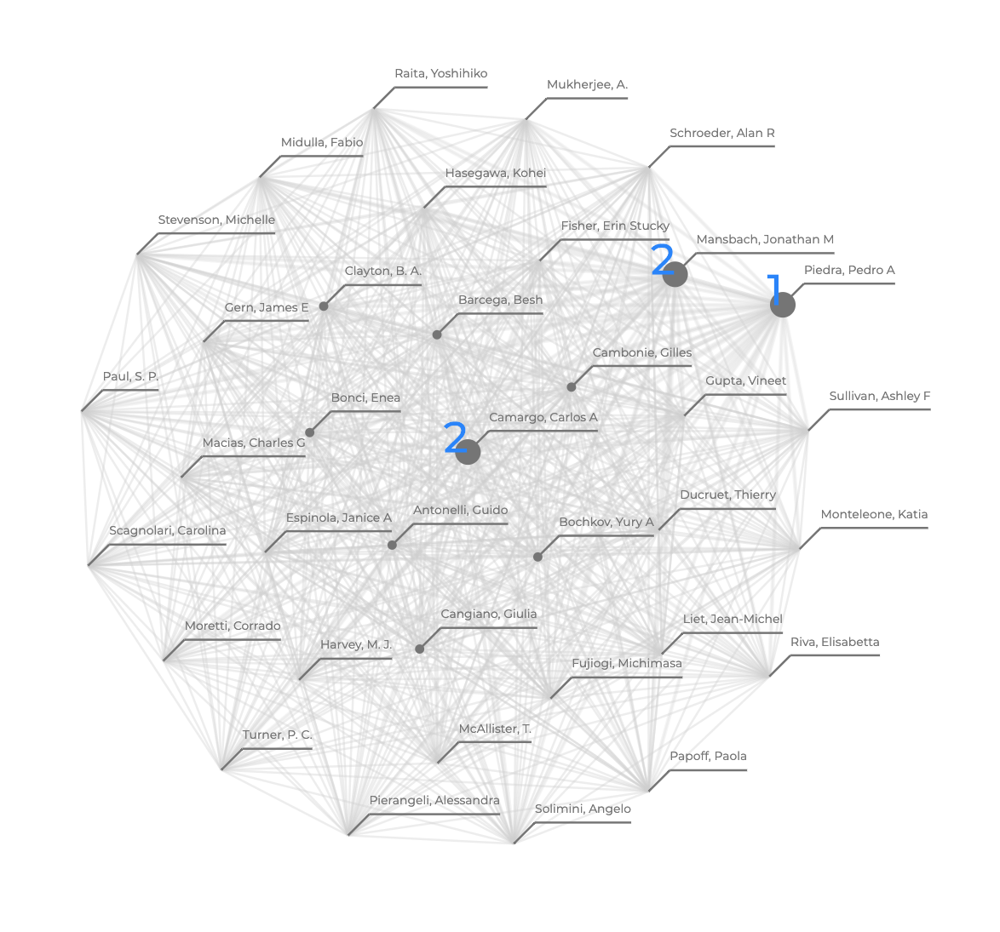

# Summary

A key question in the analysis of collaborative networks is: "Who are 
the most prestigious authors?" Answering this question can be useful 
in identifying subject matter experts or in ranking search results (for 
a particular topic), a capability that can subsequently be incorporated 
into search tools. The AuthorRank [@Liu2005] approach and Python library 
described here implements an approach to determining the most prestigious authors across a 
research network utilizing a body of research papers.

AuthorRank is a modification of PageRank [@PageBrin1999], Google's original algorithm 
for ranking webpage search results. PageRank works on the idea of 
transferred status. The rank of a page is the sum of the ranks of its 
backlinks - if a webpage has many backlinks or a few highly ranked 
backlinks, its rank is also high. The algorithm works over a directed 
graph in which nodes are webpages and a directed edge represents a 
link from one page to another. It is assumed that each node transfers 
its rank evenly to all of the other nodes it connects to. Instead of 
webpages, AuthorRank creates a co-authorship network that represents 
the structure of scientific collaborations and the status of individual 
researchers. In the network, each node represents an author and each 
edge represents a collaboration. Edges are bi-directional to represent 
the symmetric nature of collaboration. Unlike PageRank in which each 
node is assumed to transfer status equally, when considering status 
in a collaboration, greater status should be given to authors who 
frequently coauthor together, and status should be diminished as the 
number of authors in a paper increases. Thus, edges are weighted 
according to frequency of co-authorship and total number of co-authors 
on articles according to the diagram shown in the figure below. 

In the image below, AuthorRank is applied to a demonstration corpus - 
academic publications related to the COVID-19 virus 
from the CORD-19 dataset [@wang-lo-2020-cord19] - and visualized 
using the browser-based library d3.js [@Bostock2011]. More specifically, 
the results below show the top authors of documents that contain 
the word "bronchiolitis" in the title. 
The  capability to visualize the resulting top author network 
is not part of the AuthorRank package, but AuthorRank does provide the 
capability to export the 
co-authorship network in a JSON format needed for visualization in d3.js, 
and we provide some example code as part of this repository.

The AuthorRank approach can be applied to the top results of a 
search query (similar to the above filtering for documents with "bronchiolitis" 
in the title) in a wide variety of use cases. 
The applicability of the AuthorRank approach is also not 
necessarily confined to research 
collaborations, and this module could be extended into other useful 
applications utilizing similar directed graphs. AuthorRank may be 
used to "quantitatively evaluate the prestige of conferences based on 
their program committees" [@Liu2005] (when considering authors' entire 
bodies of work) or used to identify subject matter experts on the 
results of a topical search through a set of academic papers (a corpus 
of documents). AuthorRank could also be conceivably applied to an email 
corpus (such as the [Enron corpus](https://www.cs.cmu.edu/~enron/)) to 
identify those which most collaborated on
a particular topic (as it is represented email).

# Related Work 

Co-authorship networks have been explored in the past, such as citation 
networks [@Garfield1979CitationII]. Citation networks, however, can occur without the authors 
knowing one another and thus do not capture collaborative relationships 
as effectively as a co-authorship network. Many other co-authorship 
networks have been explored, such as the Erdos Number Project [@DeCastro1999] which explored 
relationships to the Hungarian mathematician and studying ACM 
conferences [@Smeaton2002, @Nascimento2003], among others. These are distinct 
algorithms to AuthorRank and were introduced in the years prior. 

The Python [@Rossum1995] NetworkX [@Hagberg2008] library implements a variety of graph centrality 
algorithms and metrics of interest to applications examining co-authorship; 
diameter, the number of components, a particular author's centrality 
in the network, and others. However, these are metrics and approaches which 
describe the graph itself or the role of a node within it, and the NetworkX 
library - while highly relevant for understanding an authorship graph 
and its functionality is used as part of this library - it is not a 
substitute for the creation of the co-authorship network. AuthorRank 
provides the capability to create a 
co-authorship network which provides indications of authors impact 
within a network (as defined in the work by [@Liu2005]), 
in which subsequent metrics and graph analysis algorithms may be applied. 

# Acknowledgements

This effort was supported in part by the Jet Propulsion Laboratory (JPL), 
managed by the California Institute of Technology on behalf of NASA.
We acknowledge the support of the Foundry A-Team program and the 
encouragement and constructive criticism of Miles Pellazar and [Asitang 
Mishra](https://github.com/asitang). We would also like to thank 
[Edward Barraza](https://github.com/edwardbarraza) and 
[Sami Sahnoune](https://github.com/samisahn) for their feedback 
of the interactive visualization. 

# References
