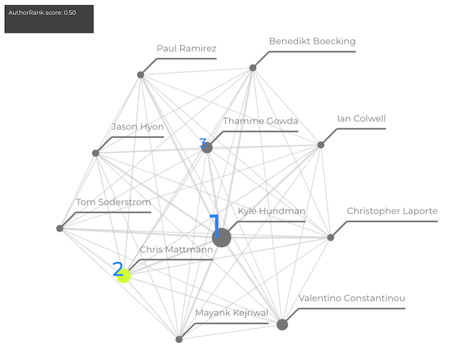

# AuthorRank Visualization

This code allows you to view the results of the 
AuthorRank approach using an interactive 
directed graph in your browser using d3.js. 



## Run 

From this directory, run the Python simple http server.

```python
python3 -m http.server 8000
```

Then visit `127.0.0.1:8000`. You can use other 
data by replacing the files in `data`. 

